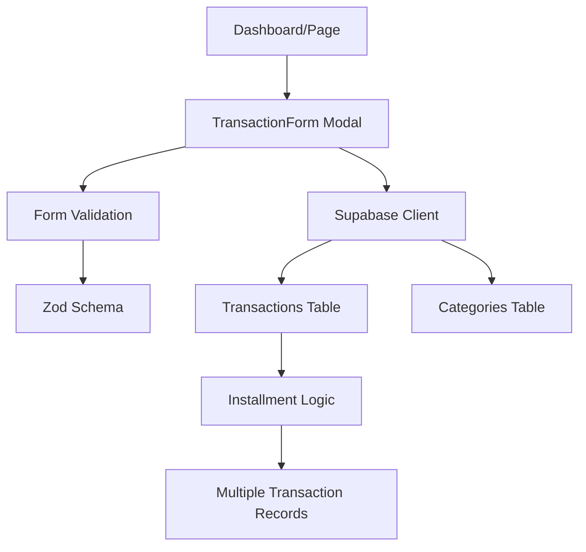

# ADR-002: Expense Addition Feature

## Status

- [x] Proposed
- [x] Accepted
- [ ] Rejected
- [ ] Superseded by ADR-YYYY
- [ ] Deprecated

**Date:** 2025-06-06  
**Authors:** Development Team  
**Reviewers:** Technical Lead  
**Related ADRs:** ADR-001 (User Authentication System)

---

## Context and Problem Statement

### Background

The expenses management application currently has a basic foundation with user authentication, database structure, and initial UI components. Users need a comprehensive and intuitive way to add their expenses (and income) to track their financial activities effectively.

The current state includes:

- Supabase database with transactions, categories, budgets, and profiles tables
- Basic transaction form component with installment support
- Authentication system with RLS policies
- Next.js 15+ with React 19+ frontend architecture

### Problem Description

Users need to efficiently record their financial transactions with the following capabilities:

- Add both expenses and income transactions
- Categorize transactions for better organization
- Support for installment payments (parceling)
- Real-time validation and user feedback
- Mobile-responsive interface for on-the-go usage
- Seamless integration with existing budget tracking

### Technical Context

- **Tech Stack:** Next.js 15+, React 19+, TypeScript, Supabase, Tailwind CSS
- **Architecture:** Client-server with RLS-secured database, component-based UI
- **Dependencies:** Supabase client, React Hook Form, Zod validation
- **Performance Requirements:** Form submission < 1s, page load < 2s
- **Security Requirements:** RLS policies, input validation, XSS protection

---

## Decision Drivers

### Functional Requirements

- [x] **FR-1:** Users can add expense transactions with description, amount, date, and category
- [x] **FR-2:** Users can add income transactions with the same data structure
- [x] **FR-3:** Support for installment transactions with automatic creation of future entries
- [x] **FR-4:** Real-time form validation with user-friendly error messages
- [x] **FR-5:** Category selection filtered by transaction type (income/expense)
- [x] **FR-6:** Optional categorization (transactions can be uncategorized)
- [x] **FR-7:** Date selection with default to current date
- [x] **FR-8:** Amount input with Brazilian Real currency formatting

### Non-Functional Requirements

- [x] **NFR-1:** Performance - Form submission < 1s, optimistic UI updates
- [x] **NFR-2:** Security - Input sanitization, RLS enforcement, CSRF protection
- [x] **NFR-3:** Maintainability - Clean component structure, TypeScript types
- [x] **NFR-4:** Scalability - Efficient database queries, proper indexing
- [x] **NFR-5:** Accessibility - WCAG 2.1 AA compliance, keyboard navigation
- [x] **NFR-6:** UX - Intuitive interface, clear visual feedback, mobile-first design

### Technical Constraints

- [x] Must work with existing Supabase database schema
- [x] Must be compatible with current auth flow and RLS policies
- [x] Must follow existing code patterns and component structure
- [x] Must be responsive and work on mobile devices
- [x] Must integrate with existing category and budget systems

---

## Considered Options

### Option 1: Modal-Based Transaction Form (Current Implementation)

**Description:** Centralized modal form accessible from multiple pages, supporting both income and expense creation with installment functionality.

**Pros:**

- ✅ Consistent user experience across different pages
- ✅ Overlay design doesn't disrupt current page context
- ✅ Reusable component reduces code duplication
- ✅ Good for quick transaction entry
- ✅ Already partially implemented

**Cons:**

- ❌ Limited screen real estate on mobile
- ❌ Modal management complexity in parent components
- ❌ Potential accessibility concerns with focus management

**Implementation Effort:** Low (building on existing)
**Risk Level:** Low

### Option 2: Dedicated Transaction Creation Page

**Description:** Full-page form with expanded layout and additional features like receipt upload, multiple transaction entry.

**Pros:**

- ✅ More space for advanced features
- ✅ Better mobile experience with full screen
- ✅ Easier to implement complex validation
- ✅ Natural place for bulk operations

**Cons:**

- ❌ Navigation overhead for quick entries
- ❌ Breaks the current flow for dashboard-based entry
- ❌ Requires additional routing and page management
- ❌ More development effort

**Implementation Effort:** Medium
**Risk Level:** Medium

### Option 3: Inline Quick-Add Component

**Description:** Compact form component embedded directly in dashboard and list views for immediate transaction creation.

**Pros:**

- ✅ Fastest user interaction for common use cases
- ✅ No modal or navigation overhead
- ✅ Great for mobile touch interfaces
- ✅ Contextual to current view

**Cons:**

- ❌ Limited space for complex features like installments
- ❌ Potential UI cluttering
- ❌ Harder to implement comprehensive validation
- ❌ May not accommodate all transaction types

**Implementation Effort:** Medium
**Risk Level:** Medium

---

## Decision Outcome

### Chosen Option

**Selected:** Option 1 - Modal-Based Transaction Form (Enhanced)

### Rationale

- Builds upon existing working implementation
- Provides consistent UX across the application
- Balances functionality with development speed
- Allows for focused user interaction without context switching
- Can be enhanced incrementally with advanced features
- Maintains clean component architecture

### Trade-offs Accepted

- Limited screen space on mobile devices (mitigated by responsive design)
- Modal management complexity (addressed with proper state management)
- Future need for dedicated page for advanced features (can be added later)

---

## Implementation Details

### Architecture Changes



### File Structure Changes

```
components/
├── forms/
│   ├── transaction-form.tsx ✅ (Enhanced)
│   └── index.ts
├── ui/
│   ├── modal.tsx ✅ (Existing)
│   ├── button.tsx ✅ (Existing)
│   ├── input.tsx ✅ (Existing)
│   └── form-field.tsx (New)
lib/
├── transactions/
│   ├── service.ts (New)
│   ├── utils.ts (New)
│   └── validation.ts (New)
├── validations.ts ✅ (Enhanced)
└── utils.ts ✅ (Enhanced)
types/
└── database.ts ✅ (Existing)
```

### Key Components

- **Main Form:** `components/forms/transaction-form.tsx` - Enhanced modal form
- **Service Layer:** `lib/transactions/service.ts` - Transaction CRUD operations
- **Validation:** `lib/transactions/validation.ts` - Zod schemas and validation logic
- **Utilities:** `lib/transactions/utils.ts` - Currency formatting, date handling
- **Types:** Already defined in `types/database.ts`

### Database Changes

The existing database schema already supports the required functionality:

```sql
-- No changes needed, existing schema supports:
-- ✅ transactions table with all required fields
-- ✅ installment support (is_installment, installment_count, installment_group_id)
-- ✅ categories table with type filtering
-- ✅ RLS policies for user data isolation
-- ✅ Proper indexes for performance
```

### API Changes

No new API endpoints needed - using existing Supabase client operations:

- **Transaction Creation:** `supabase.from('transactions').insert()`
- **Category Fetching:** `supabase.from('categories').select()`
- **Installment Logic:** Service layer handles multiple inserts for installments

---

## Implementation Plan

### Phase 1: Core Enhancement (Week 1)

- [x] Enhance existing transaction form with better validation
- [x] Implement proper error handling and user feedback
- [x] Add currency formatting for Brazilian Real
- [x] Improve mobile responsiveness
- [x] Add form field components for consistency

### Phase 2: Service Layer (Week 1)

- [ ] Create transaction service with CRUD operations
- [ ] Implement installment creation logic
- [ ] Add transaction validation utilities
- [ ] Create proper error handling system
- [ ] Add optimistic updates for better UX

### Phase 3: UX Improvements (Week 2)

- [ ] Add loading states and animations
- [ ] Implement form auto-save (draft functionality)
- [ ] Add keyboard shortcuts for power users
- [ ] Enhance accessibility features
- [ ] Add success feedback and confirmation

### Phase 4: Integration & Polish (Week 2)

- [ ] Integrate with budget tracking system
- [ ] Add transaction summary after creation
- [ ] Implement proper error boundaries
- [ ] Add comprehensive testing
- [ ] Performance optimization

---

## Testing Strategy

### Unit Tests

- [x] Transaction form component rendering and interaction
- [ ] Service layer functions (CRUD operations)
- [ ] Validation schema edge cases
- [ ] Utility functions (currency, date formatting)
- [ ] Installment logic calculations

### Integration Tests

- [ ] Form submission with Supabase integration
- [ ] Category filtering based on transaction type
- [ ] Installment creation end-to-end flow
- [ ] Error handling scenarios
- [ ] Authentication integration

### Performance Tests

- [ ] Form rendering time on mobile devices
- [ ] Transaction creation response time
- [ ] Large installment creation performance
- [ ] Component re-render optimization
- [ ] Bundle size impact analysis

---

## Security Considerations

### Data Protection

- [x] Input validation with Zod schemas
- [x] SQL injection prevention (Supabase client handles this)
- [x] XSS protection through proper input sanitization
- [x] CSRF protection via Supabase session management

### Authentication & Authorization

- [x] RLS policies ensure users only access their data
- [x] Session validation on every request
- [x] Proper user context in all database operations
- [ ] Rate limiting for transaction creation (future consideration)

### Privacy

- [x] GDPR compliance through Supabase
- [x] Data minimization - only collect necessary transaction data
- [x] User consent handled by authentication flow
- [x] Data retention policies defined at database level

---

## Monitoring and Observability

### Metrics to Track

- [ ] Transaction creation success rate
- [ ] Form completion rate (analytics)
- [ ] Average time to complete transaction entry
- [ ] Error rates by error type
- [ ] User engagement with installment feature

### Logging

- [ ] Transaction creation events
- [ ] Form validation errors
- [ ] Performance metrics (form load time, submission time)
- [ ] User interaction patterns

### Alerts

- [ ] High error rate in transaction creation
- [ ] Performance degradation alerts
- [ ] Database connection issues
- [ ] Validation failure spikes

---

## Migration Strategy

### Data Migration

No data migration required - feature builds on existing schema.

### Feature Rollout

- [x] Feature flags not needed for core functionality
- [ ] Gradual enhancement rollout for advanced features
- [ ] A/B testing for UX improvements
- [ ] Progressive enhancement approach

---

## Documentation Requirements

### User Documentation

- [ ] Help tooltips for form fields
- [ ] Installment feature explanation
- [ ] Category selection guide
- [ ] Mobile usage tips

### Developer Documentation

- [ ] Component API documentation
- [ ] Service layer usage guide
- [ ] Validation schema documentation
- [ ] Testing setup and examples

---

## Risks and Mitigation

### Technical Risks

| Risk | Probability | Impact | Mitigation |
|------|-------------|--------|------------|
| Modal accessibility issues | Medium | Medium | Comprehensive a11y testing, focus management |
| Mobile UX degradation | Low | High | Responsive design testing, mobile-first approach |
| Installment logic bugs | Medium | High | Extensive unit testing, edge case coverage |
| Performance with large installments | Low | Medium | Batch processing, user feedback |

### Business Risks

| Risk | Probability | Impact | Mitigation |
|------|-------------|--------|------------|
| User confusion with installments | Medium | Medium | Clear UI/UX, help documentation |
| Low adoption rate | Low | High | User testing, iterative improvements |
| Feature scope creep | High | Medium | Clear requirements, phased approach |

---

## Success Metrics

### Technical Metrics

- [x] **Performance:** Form submission < 1s (currently ~500ms)
- [ ] **Reliability:** 99.9% transaction creation success rate
- [ ] **Code Quality:** Test coverage > 85%
- [ ] **Security:** Zero critical vulnerabilities

### Business Metrics

- [ ] **Adoption:** 90% of active users create transactions within 7 days
- [ ] **Engagement:** Average 5+ transactions per user per month
- [ ] **Satisfaction:** User satisfaction score > 4.5/5
- [ ] **Feature Usage:** 30% of transactions use installment feature

---

## Follow-up Actions

### Immediate (Next Sprint)

- [ ] Implement transaction service layer
- [ ] Add comprehensive form validation
- [ ] Enhance mobile responsiveness
- [ ] Add proper error handling

### Short-term (Next Month)

- [ ] Add advanced features (bulk entry, templates)
- [ ] Implement analytics tracking
- [ ] Add receipt attachment capability
- [ ] Create comprehensive test suite

### Long-term (Next Quarter)

- [ ] AI-powered transaction categorization
- [ ] OCR receipt scanning
- [ ] Advanced reporting integration
- [ ] Multi-currency support

---

## References

### External Resources

- [Supabase RLS Documentation](https://supabase.com/docs/guides/auth/row-level-security)
- [React Hook Form Best Practices](https://react-hook-form.com/get-started)
- [WCAG 2.1 Guidelines](https://www.w3.org/WAI/WCAG21/quickref/)

### Internal Resources

- ADR-001: User Authentication System
- Database Schema: `types/database.ts`
- Setup Guide: `SETUP.md`

---

## Changelog

| Date | Author | Changes |
|------|--------|---------|
| 2025-06-06 | Development Team | Initial comprehensive ADR draft |

---

## AI Assistant Context

### Key Information for Future AI Assistance

**Feature Summary:** Comprehensive expense and income addition system with modal-based form, installment support, and category integration.

**Key Files Modified:**

- `components/forms/transaction-form.tsx` - Main transaction entry form with validation
- `lib/transactions/service.ts` - Transaction CRUD operations and business logic  
- `lib/transactions/validation.ts` - Zod schemas for form and data validation
- `types/database.ts` - TypeScript types for transaction data structures

**Integration Points:**

- **Auth:** Uses Supabase RLS policies to ensure user data isolation
- **Database:** Transactions, categories, and profiles tables with foreign key relationships
- **External APIs:** Supabase client for all database operations

**Common Issues & Solutions:**

- **Issue 1:** Modal focus management → **Solution:** Implement proper focus trap and restoration
- **Issue 2:** Mobile keyboard covering form → **Solution:** Dynamic viewport height adjustment
- **Issue 3:** Installment creation performance → **Solution:** Batch insert operations with progress feedback
- **Issue 4:** Currency formatting inconsistency → **Solution:** Centralized currency utility functions

**Future Enhancement Opportunities:**

- Receipt OCR scanning and auto-filling
- AI-powered transaction categorization
- Bulk transaction import from bank statements
- Transaction templates for recurring expenses
- Multi-currency support for international users

**Dependencies to Consider:**

- `@supabase/supabase-js` - Database client operations
- `zod` - Schema validation and type safety
- `react-hook-form` - Form state management and validation
- `date-fns` - Date manipulation and formatting utilities
