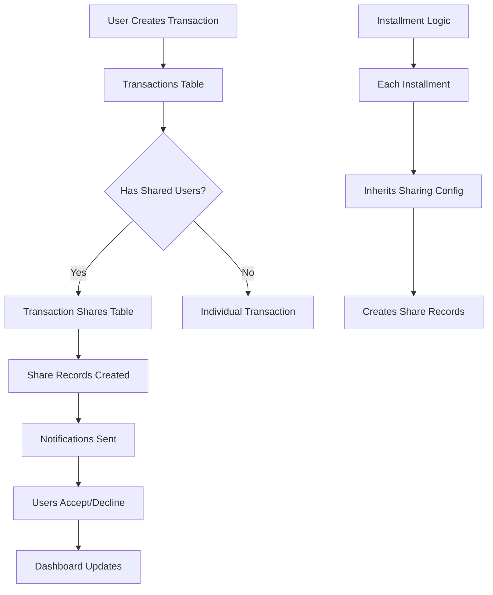

# ADR-004: Shared Transactions Feature

## Status

- [x] Proposed
- [ ] Accepted
- [ ] Rejected
- [ ] Superseded by ADR-YYYY
- [ ] Deprecated

**Date:** 2025-06-06  
**Authors:** Development Team  
**Reviewers:** Technical Lead  
**Related ADRs:** ADR-001 (User Authentication System), ADR-002 (Expense Addition Feature)

---

## Context and Problem Statement

### Background

The expenses management application currently supports individual transaction management where each transaction belongs exclusively to its creator. However, in real-world scenarios, financial transactions are often shared between multiple users - such as couples, roommates, families, or business partners who split costs.

Current state:

- Each transaction belongs to a single user (owner)
- No mechanism to share transaction costs with other users
- Budget tracking and financial reports are limited to individual users
- Installment transactions create multiple entries for the same user

### Problem Description

Users need the ability to share transaction costs with other users in the system while maintaining clear ownership and accountability. Key scenarios include:

- **Couple Dining:** One person pays the restaurant bill but the cost should be split between both partners
- **Shared Utilities:** One roommate pays the electricity bill that should be divided among all residents
- **Business Expenses:** Team leader pays for a team lunch that should be attributed to all team members
- **Family Expenses:** Parent pays for children's activities that should be tracked for each child
- **Installment Sharing:** When installments are created, each installment should maintain the same sharing configuration

### Technical Context

- **Tech Stack:** Next.js 15+, React 19+, TypeScript, Supabase, Tailwind CSS
- **Architecture:** Client-server with RLS-secured database, component-based UI
- **Dependencies:** Supabase client, React Hook Form, Zod validation
- **Performance Requirements:** Transaction creation < 2s, dashboard load < 3s
- **Security Requirements:** RLS policies, user permission validation, data privacy

---

## Decision Drivers

### Functional Requirements

- [ ] **FR-1:** Transaction owner can share costs with other system users
- [ ] **FR-2:** Support multiple sharing methods (equal split, percentage-based, fixed amounts)
- [ ] **FR-3:** Shared users can view transactions shared with them (read-only)
- [ ] **FR-4:** Installment transactions maintain sharing configuration across all installments
- [ ] **FR-5:** Dashboard and reports reflect both owned and shared transactions
- [ ] **FR-6:** Owner retains full control over shared transactions (edit/delete)
- [ ] **FR-7:** Notification system for users when transactions are shared with them
- [ ] **FR-8:** Ability to accept/decline shared transaction participation
- [ ] **FR-9:** Settlement tracking for shared expenses

### Non-Functional Requirements

- [ ] **NFR-1:** Performance - Dashboard with shared transactions loads < 3s
- [ ] **NFR-2:** Security - Users can only see transactions they own or are shared with
- [ ] **NFR-3:** Privacy - Shared users see only necessary transaction details
- [ ] **NFR-4:** Scalability - Support for transactions shared with up to 10 users
- [ ] **NFR-5:** Accessibility - WCAG 2.1 AA compliance for all new components
- [ ] **NFR-6:** Data Integrity - Consistent sharing state across all installments

### Technical Constraints

- [ ] Must maintain backward compatibility with existing transactions
- [ ] Must work with existing Supabase RLS policies
- [ ] Must integrate with current installment system
- [ ] Must preserve existing dashboard performance
- [ ] Must follow established authentication patterns

---

## Considered Options

### Option 1: Junction Table with User References (Recommended)

**Description:** Create a `transaction_shares` junction table to manage many-to-many relationships between transactions and users, with additional metadata for sharing configuration.

**Pros:**

- ✅ Normalized database design
- ✅ Flexible sharing configurations (equal, percentage, fixed)
- ✅ Easy to query shared transactions
- ✅ Supports complex sharing scenarios
- ✅ Maintains data integrity
- ✅ Can track acceptance/decline status

**Cons:**

- ❌ Additional database complexity
- ❌ More complex queries for transaction lists
- ❌ Requires migration for existing data

**Implementation Effort:** High
**Risk Level:** Medium

### Option 2: JSON Array in Transactions Table

**Description:** Add a `shared_with` JSONB column to the transactions table containing user IDs and sharing configuration.

**Pros:**

- ✅ Simple database structure
- ✅ No additional tables needed
- ✅ Fast queries for individual transactions
- ✅ Easy to implement

**Cons:**

- ❌ Difficult to query by shared user
- ❌ Limited flexibility for complex sharing
- ❌ Harder to maintain data integrity
- ❌ PostgreSQL JSONB querying complexity
- ❌ Difficult to implement proper RLS policies

**Implementation Effort:** Medium
**Risk Level:** High

### Option 3: Duplicate Transactions Approach

**Description:** Create separate transaction records for each shared user with references to the original transaction.

**Pros:**

- ✅ Simple querying (each user has their own records)
- ✅ Easy integration with existing code
- ✅ Clear data ownership

**Cons:**

- ❌ Data duplication and inconsistency risks
- ❌ Complex synchronization when editing
- ❌ Storage inefficiency
- ❌ Difficult to maintain transaction integrity
- ❌ Problems with installment synchronization

**Implementation Effort:** Medium
**Risk Level:** High

---

## Decision Outcome

### Chosen Option

**Selected:** Option 1 - Junction Table with User References

### Rationale

- Provides the most flexible and scalable solution
- Maintains proper database normalization
- Supports complex sharing scenarios and future enhancements
- Enables proper RLS policies for security
- Allows for detailed tracking and analytics
- Best long-term architectural choice despite initial complexity

### Trade-offs Accepted

- Higher initial implementation complexity
- More complex database queries
- Need for data migration strategy
- Additional testing requirements for junction table scenarios

---

## Implementation Details

### Architecture Changes



### Database Schema Changes

```sql
-- New table for managing transaction shares
CREATE TABLE transaction_shares (
  id UUID PRIMARY KEY DEFAULT gen_random_uuid(),
  transaction_id UUID NOT NULL REFERENCES transactions(id) ON DELETE CASCADE,
  shared_with_user_id UUID NOT NULL REFERENCES auth.users(id) ON DELETE CASCADE,
  share_type VARCHAR NOT NULL CHECK (share_type IN ('equal', 'percentage', 'fixed_amount')),
  share_value DECIMAL(10,4), -- Percentage (0.25 = 25%) or fixed amount
  status VARCHAR NOT NULL DEFAULT 'pending' CHECK (status IN ('pending', 'accepted', 'declined')),
  created_at TIMESTAMP WITH TIME ZONE DEFAULT NOW(),
  updated_at TIMESTAMP WITH TIME ZONE DEFAULT NOW(),
  
  -- Ensure unique sharing per transaction per user
  UNIQUE(transaction_id, shared_with_user_id)
);

-- Add indexes for performance
CREATE INDEX idx_transaction_shares_transaction_id ON transaction_shares(transaction_id);
CREATE INDEX idx_transaction_shares_user_id ON transaction_shares(shared_with_user_id);
CREATE INDEX idx_transaction_shares_status ON transaction_shares(status);

-- Add trigger for updated_at
CREATE OR REPLACE FUNCTION update_updated_at_column()
RETURNS TRIGGER AS $$
BEGIN
    NEW.updated_at = NOW();
    RETURN NEW;
END;
$$ language 'plpgsql';

CREATE TRIGGER update_transaction_shares_updated_at 
  BEFORE UPDATE ON transaction_shares 
  FOR EACH ROW EXECUTE FUNCTION update_updated_at_column();

-- RLS Policies for transaction_shares
ALTER TABLE transaction_shares ENABLE ROW LEVEL SECURITY;

-- Users can see shares for transactions they own
CREATE POLICY "Users can see shares for their transactions" ON transaction_shares
  FOR SELECT USING (
    EXISTS (
      SELECT 1 FROM transactions 
      WHERE transactions.id = transaction_shares.transaction_id 
      AND transactions.user_id = auth.uid()
    )
  );

-- Users can see shares where they are the shared user
CREATE POLICY "Users can see shares assigned to them" ON transaction_shares
  FOR SELECT USING (shared_with_user_id = auth.uid());

-- Only transaction owners can insert/update/delete shares
CREATE POLICY "Only transaction owners can manage shares" ON transaction_shares
  FOR ALL USING (
    EXISTS (
      SELECT 1 FROM transactions 
      WHERE transactions.id = transaction_shares.transaction_id 
      AND transactions.user_id = auth.uid()
    )
  );

-- Shared users can update their acceptance status
CREATE POLICY "Shared users can update their status" ON transaction_shares
  FOR UPDATE USING (shared_with_user_id = auth.uid())
  WITH CHECK (shared_with_user_id = auth.uid());

-- Add notification preferences to profiles
ALTER TABLE profiles ADD COLUMN IF NOT EXISTS 
  notification_shared_transactions BOOLEAN DEFAULT true;
```

### File Structure Changes

```
app/
├── shared-transactions/
│   ├── page.tsx (New - Shared transactions dashboard)
│   └── [transactionId]/
│       └── page.tsx (New - Transaction sharing details)
components/
├── transactions/
│   ├── transaction-sharing-form.tsx (New)
│   ├── shared-transaction-card.tsx (New)
│   ├── sharing-status-badge.tsx (New)
│   └── settlement-tracker.tsx (New)
├── dashboard/
│   ├── shared-transactions-summary.tsx (New)
│   └── transaction-history.tsx (Enhanced)
├── forms/
│   └── transaction-form.tsx (Enhanced - Add sharing options)
├── ui/
│   ├── user-search.tsx (New)
│   └── share-calculator.tsx (New)
lib/
├── shared-transactions/
│   ├── service.ts (New)
│   ├── calculations.ts (New)
│   └── notifications.ts (New)
├── validations.ts (Enhanced)
└── utils.ts (Enhanced)
types/
├── shared-transactions.ts (New)
└── database.ts (Enhanced)
```

### Key Components

#### 1. Transaction Sharing Form Component

```typescript
// components/transactions/transaction-sharing-form.tsx
interface TransactionSharingFormProps {
  transactionId: string;
  currentShares?: TransactionShare[];
  onSharingUpdate: (shares: TransactionShareInput[]) => void;
}

interface TransactionShareInput {
  userId: string;
  shareType: 'equal' | 'percentage' | 'fixed_amount';
  shareValue?: number;
}
```

#### 2. Shared Transaction Service

```typescript
// lib/shared-transactions/service.ts
class SharedTransactionService {
  async createTransactionShares(transactionId: string, shares: TransactionShareInput[]): Promise<void>
  async updateShareStatus(shareId: string, status: 'accepted' | 'declined'): Promise<void>
  async getSharedTransactions(userId: string): Promise<TransactionWithShares[]>
  async calculateSettlements(userIds: string[]): Promise<Settlement[]>
  async deleteTransactionShares(transactionId: string): Promise<void>
}
```

#### 3. Enhanced Database Types

```typescript
// types/shared-transactions.ts
export interface TransactionShare {
  id: string;
  transaction_id: string;
  shared_with_user_id: string;
  share_type: 'equal' | 'percentage' | 'fixed_amount';
  share_value: number | null;
  status: 'pending' | 'accepted' | 'declined';
  created_at: string;
  updated_at: string;
}

export interface TransactionWithShares extends Transaction {
  transaction_shares: (TransactionShare & { 
    profiles: Pick<Profile, 'full_name' | 'email'> 
  })[];
  calculated_user_amount?: number; // Amount for current user
}

export interface Settlement {
  from_user_id: string;
  to_user_id: string;
  amount: number;
  transactions: string[]; // Transaction IDs involved
}
```

---

## Implementation Plan

### Phase 1: Database Foundation (Week 1)

- [ ] Create transaction_shares table with proper schema
- [ ] Implement RLS policies for security
- [ ] Add database indexes for performance
- [ ] Create migration scripts for existing data
- [ ] Add notification preferences to profiles

### Phase 2: Core Backend Services (Week 2)

- [ ] Implement SharedTransactionService class
- [ ] Create sharing calculation utilities
- [ ] Add transaction sharing validation schemas
- [ ] Implement notification service for sharing events
- [ ] Add comprehensive error handling

### Phase 3: UI Components (Week 3)

- [ ] Create transaction sharing form component
- [ ] Build user search and selection interface
- [ ] Implement sharing status badges and indicators
- [ ] Create shared transaction dashboard page
- [ ] Add sharing options to existing transaction form

### Phase 4: Integration & Enhancement (Week 4)

- [ ] Integrate sharing with installment system
- [ ] Enhance dashboard to show shared transactions
- [ ] Implement settlement tracking and suggestions
- [ ] Add notification system for sharing events
- [ ] Create comprehensive test suite

### Phase 5: Advanced Features (Week 5)

- [ ] Add sharing templates for common scenarios
- [ ] Implement bulk sharing operations
- [ ] Create sharing analytics and insights
- [ ] Add export functionality for shared transactions
- [ ] Optimize performance for large sharing groups

---

## UI/UX Implementation Plan

### 1. Transaction Form Enhancement

**Location:** `components/forms/transaction-form.tsx`

**New Features:**

- "Share with others" toggle section
- User search and selection component
- Sharing method selector (equal split, percentages, fixed amounts)
- Real-time calculation preview
- Share validation and error handling

**Design Considerations:**

- Expandable section to maintain form simplicity
- Clear visual indication of sharing impact on user's amount
- Mobile-optimized user selection interface
- Accessibility-focused implementation

### 2. Dashboard Integration

**Location:** `components/dashboard/` directory

**Enhancements:**

- **Metrics Cards:** Include shared transaction amounts in totals
- **Transaction History:** Visual indicators for shared transactions
- **New Summary Card:** "Shared Transactions" with pending/accepted counts
- **Quick Actions:** "Settle up" button for pending settlements

**Visual Design:**

- Distinct styling for shared vs. owned transactions
- Status badges for sharing acceptance
- Color-coded sharing indicators
- Progress bars for settlement tracking

### 3. Shared Transactions Dashboard

**Location:** `app/shared-transactions/page.tsx`

**Features:**

- Tabbed interface: "Shared with me" | "I shared" | "Settlements"
- Filter by status (pending, accepted, declined)
- Sort by date, amount, or sharing status
- Quick actions for accepting/declining shares
- Settlement recommendations and tracking

### 4. Mobile-First Considerations

**Responsive Design:**

- Collapsible sharing sections on mobile
- Touch-friendly user selection interface
- Simplified sharing method selection
- Optimized notification handling
- Fast share acceptance/decline actions

### 5. Notification System

**Implementation:**

- In-app notification badge for pending shares
- Email notifications for sharing invitations
- Push notifications for mobile users
- Notification preferences in user settings
- Real-time updates using Supabase realtime

---

## Testing Strategy

### Unit Tests

- [ ] TransactionShare model validation and relationships
- [ ] Sharing calculation utilities (equal, percentage, fixed)
- [ ] Service layer methods for CRUD operations
- [ ] Component rendering with different sharing states
- [ ] Form validation for sharing configurations

### Integration Tests

- [ ] End-to-end transaction sharing workflow
- [ ] RLS policy enforcement for shared transactions
- [ ] Installment sharing inheritance
- [ ] Notification system integration
- [ ] Dashboard data aggregation with shared transactions

### Performance Tests

- [ ] Database query performance with sharing joins
- [ ] Dashboard loading time with large shared transaction sets
- [ ] User search performance with large user base
- [ ] Sharing calculation performance
- [ ] Mobile interface responsiveness

### Security Tests

- [ ] RLS policy validation for all sharing scenarios
- [ ] User permission validation for share operations
- [ ] Data privacy compliance for shared information
- [ ] Input validation and sanitization
- [ ] Authentication integration testing

---

## Security Considerations

### Data Protection

- [ ] **Input Validation:** Comprehensive Zod schemas for all sharing operations
- [ ] **SQL Injection:** Prevented through Supabase client usage
- [ ] **XSS Protection:** Proper input sanitization and output encoding
- [ ] **Data Minimization:** Shared users see only necessary transaction details

### Authentication & Authorization

- [ ] **RLS Policies:** Multi-layered policies for transaction_shares table
- [ ] **Permission Validation:** Server-side validation for all sharing operations
- [ ] **User Context:** Proper user identification in all database operations
- [ ] **Rate Limiting:** Protection against sharing spam and abuse

### Privacy Compliance

- [ ] **Data Sharing Consent:** Explicit user consent for transaction sharing
- [ ] **Granular Permissions:** Control over what data is shared
- [ ] **Right to Withdrawal:** Users can decline or leave shared transactions
- [ ] **Data Retention:** Clear policies for shared transaction data

### Audit Trail

- [ ] **Change Tracking:** Log all sharing-related operations
- [ ] **User Actions:** Track sharing invitations, acceptances, declines
- [ ] **Data Access:** Monitor access to shared transaction data
- [ ] **Compliance Reporting:** Generate reports for data sharing activities

---

## Performance Optimization

### Database Optimization

- [ ] **Efficient Indexes:** Strategic indexing for sharing queries
- [ ] **Query Optimization:** Minimize N+1 queries with proper joins
- [ ] **Batch Operations:** Bulk sharing operations for installments
- [ ] **Connection Pooling:** Optimize database connection usage

### Frontend Optimization

- [ ] **Lazy Loading:** Load sharing data only when needed
- [ ] **Caching Strategy:** Cache user search results and sharing data
- [ ] **Optimistic Updates:** Immediate UI feedback for sharing actions
- [ ] **Code Splitting:** Separate bundles for sharing functionality

### Real-time Updates

- [ ] **Supabase Realtime:** Live updates for sharing status changes
- [ ] **Selective Subscriptions:** Subscribe only to relevant sharing events
- [ ] **Debounced Updates:** Prevent excessive real-time updates
- [ ] **Offline Support:** Handle sharing operations when offline

---

## Monitoring and Observability

### Business Metrics

- [ ] **Sharing Adoption Rate:** Percentage of users using sharing features
- [ ] **Share Acceptance Rate:** Ratio of accepted vs. declined shares
- [ ] **Settlement Completion Rate:** How often users complete settlements
- [ ] **Feature Usage Patterns:** Most common sharing scenarios

### Technical Metrics

- [ ] **Database Performance:** Query execution times for sharing operations
- [ ] **API Response Times:** Sharing-related endpoint performance
- [ ] **Error Rates:** Sharing operation failure rates
- [ ] **User Experience:** Time to complete sharing workflows

### Security Monitoring

- [ ] **Access Patterns:** Monitor unusual sharing access patterns
- [ ] **Permission Violations:** Track RLS policy violations
- [ ] **Data Exposure:** Monitor for potential data leaks
- [ ] **User Behavior:** Detect suspicious sharing patterns

---

## Migration Strategy

### Data Migration

**Phase 1: Schema Migration**

- [ ] Create transaction_shares table
- [ ] Add indexes and constraints
- [ ] Implement RLS policies
- [ ] Test with sample data

**Phase 2: Feature Flag Rollout**

- [ ] Implement feature flags for sharing functionality
- [ ] Enable for internal testing
- [ ] Gradual rollout to user segments
- [ ] Monitor for issues and performance impact

**Phase 3: Full Deployment**

- [ ] Enable sharing for all users
- [ ] Monitor adoption and usage patterns
- [ ] Collect user feedback
- [ ] Iterate on UX improvements

### Rollback Strategy

- [ ] **Feature Flags:** Quick disable of sharing functionality
- [ ] **Data Preservation:** Maintain existing transaction data integrity
- [ ] **Graceful Degradation:** System continues working without sharing
- [ ] **User Communication:** Clear messaging about feature changes

---

## Success Metrics

### Technical Metrics

- [ ] **Performance:** Shared transaction queries < 500ms
- [ ] **Reliability:** 99.9% sharing operation success rate
- [ ] **Code Quality:** Test coverage > 90% for sharing features
- [ ] **Security:** Zero critical sharing-related vulnerabilities

### Business Metrics

- [ ] **Adoption:** 40% of active users try sharing within 30 days
- [ ] **Engagement:** 25% of transactions include sharing within 60 days
- [ ] **Satisfaction:** User satisfaction score > 4.2/5 for sharing features
- [ ] **Retention:** Users with shared transactions have 20% higher retention

### User Experience Metrics

- [ ] **Completion Rate:** 85% of started sharing workflows completed
- [ ] **Time to Share:** Average time to add sharing < 30 seconds
- [ ] **Error Rate:** < 5% error rate in sharing operations
- [ ] **Mobile Usage:** 60% of sharing operations completed on mobile

---

## Future Enhancement Opportunities

### Advanced Sharing Features

- [ ] **Recurring Shared Transactions:** Automatic sharing for recurring expenses
- [ ] **Sharing Groups:** Pre-defined groups for common sharing scenarios
- [ ] **Smart Suggestions:** AI-powered sharing suggestions based on patterns
- [ ] **Integration with Banking:** Automatic sharing detection from bank transactions

### Financial Management

- [ ] **Debt Tracking:** Track and manage debt between users
- [ ] **Payment Integration:** Direct payment processing for settlements
- [ ] **Expense Splitting Apps:** Integration with Splitwise, Venmo, etc.
- [ ] **Tax Reporting:** Generate reports for shared business expenses

### Social Features

- [ ] **Sharing History:** Detailed history and analytics of sharing patterns
- [ ] **Social Dashboard:** Activity feed for sharing group
- [ ] **Collaboration Tools:** Comments and notes on shared transactions
- [ ] **Family Budgets:** Shared budgets and financial goals

---

## References

### External Resources

- [Supabase RLS Best Practices](https://supabase.com/docs/guides/auth/row-level-security)
- [Multi-tenant Architecture Patterns](https://docs.microsoft.com/en-us/azure/architecture/patterns/)
- [Financial Data Privacy Regulations](https://www.privacy-regulation.eu/en/)

### Internal Resources

- ADR-001: User Authentication System
- ADR-002: Expense Addition Feature
- Database Schema: `types/database.ts`
- Setup Guide: `SETUP.md`

---

## Risks and Mitigation

### Technical Risks

| Risk | Probability | Impact | Mitigation |
|------|-------------|--------|------------|
| Complex query performance degradation | Medium | High | Proper indexing, query optimization, performance testing |
| RLS policy conflicts | Medium | High | Comprehensive policy testing, security audits |
| Data consistency issues with installments | High | Medium | Transactional operations, rollback strategies |
| Mobile UX complexity | Medium | Medium | Mobile-first design, user testing |

### Business Risks

| Risk | Probability | Impact | Mitigation |
|------|-------------|--------|------------|
| Low user adoption | Medium | High | User research, iterative UX improvements |
| Privacy concerns | Low | High | Clear privacy policies, granular controls |
| Feature complexity overwhelming users | Medium | Medium | Progressive disclosure, excellent onboarding |
| Support overhead increase | High | Medium | Comprehensive documentation, self-service tools |

### Security Risks

| Risk | Probability | Impact | Mitigation |
|------|-------------|--------|------------|
| Unauthorized data access | Low | High | Multiple RLS policy layers, security audits |
| Data leakage through sharing | Medium | High | Minimal data sharing, user consent |
| Sharing spam/abuse | Medium | Medium | Rate limiting, user reporting, moderation |

---

## Follow-up Actions

### Immediate (Next Sprint)

- [ ] Create detailed database migration plan
- [ ] Design sharing form UI/UX mockups
- [ ] Set up development environment for sharing features
- [ ] Create comprehensive test plan

### Short-term (Next Month)

- [ ] Implement core sharing functionality
- [ ] Create user onboarding for sharing features
- [ ] Establish monitoring and analytics
- [ ] Conduct security audit

### Long-term (Next Quarter)

- [ ] Advanced sharing features (groups, templates)
- [ ] Mobile app integration
- [ ] Third-party integrations
- [ ] International market considerations

---

## Changelog

| Date | Author | Changes |
|------|--------|---------|
| 2025-06-06 | Development Team | Initial comprehensive ADR creation |

---

## AI Assistant Context

### Key Information for Future AI Assistance

**Feature Summary:** Comprehensive transaction sharing system allowing users to split expenses with other users while maintaining ownership and providing settlement tracking.

**Key Files Created/Modified:**

- `docs/adr-004-shared-transactions-feature.md` - This ADR document
- `types/shared-transactions.ts` - TypeScript types for sharing functionality
- `lib/shared-transactions/service.ts` - Core sharing business logic and database operations
- `components/transactions/transaction-sharing-form.tsx` - Main sharing configuration UI
- Database migration for `transaction_shares` table and RLS policies

**Integration Points:**

- **Auth:** Extends existing Supabase RLS policies for multi-user data access
- **Database:** New junction table with foreign keys to transactions and users
- **Installments:** Sharing configuration inherited across all installment transactions
- **Notifications:** Integration with notification system for sharing events

**Common Issues & Solutions:**

- **Issue 1:** Complex RLS policies for shared data → **Solution:** Layered policies with clear user context validation
- **Issue 2:** Performance with large sharing groups → **Solution:** Efficient indexing and query optimization
- **Issue 3:** Installment sharing synchronization → **Solution:** Transactional operations and consistency checks
- **Issue 4:** Mobile UX for user selection → **Solution:** Touch-optimized search and selection interface

**Future Enhancement Opportunities:**

- Recurring shared transactions for subscriptions
- AI-powered sharing suggestions based on transaction patterns
- Integration with external payment platforms for automatic settlements
- Advanced analytics for shared spending patterns
- Family/group budget management with shared goals

**Dependencies to Consider:**

- `@supabase/supabase-js` - Enhanced for junction table operations
- User search functionality for finding users to share with
- Real-time notifications for sharing status updates
- Mobile-optimized components for sharing workflows
- Settlement calculation algorithms for complex sharing scenarios
