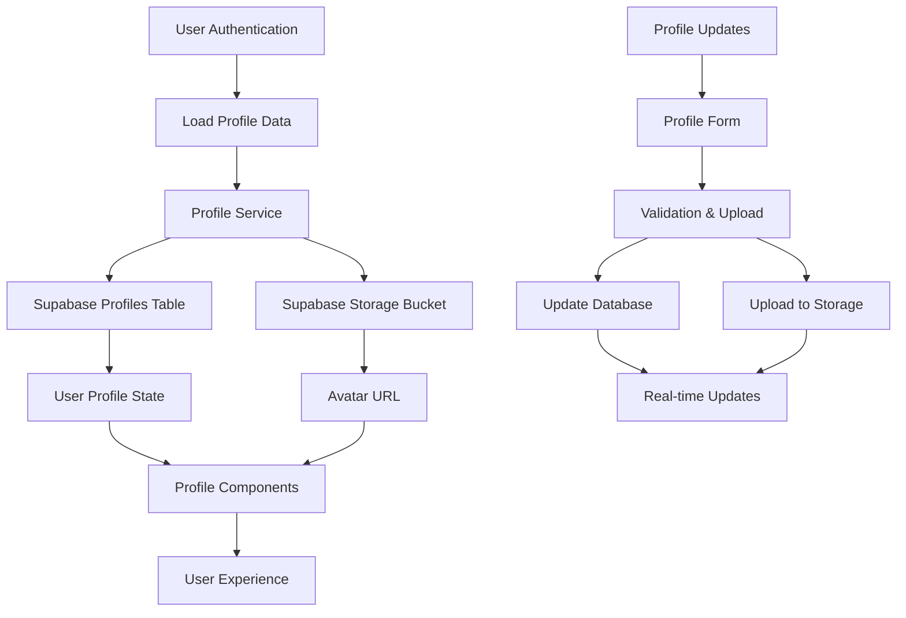

# ADR-005: User Profiles System

## Status

- [x] Proposed
- [ ] Accepted
- [ ] Rejected
- [ ] Superseded by ADR-YYYY
- [ ] Deprecated

**Date:** 2025-06-07  
**Authors:** Development Team  
**Reviewers:** Technical Lead  
**Related ADRs:** ADR-001 (User Authentication System), ADR-004 (Shared Transactions Feature)

---

## Context and Problem Statement

### Background

The expenses management application currently uses Supabase Auth for user authentication, which provides basic user information (id, email, auth metadata). However, for a complete user experience, we need extended user profile information including display names, profile pictures, and user preferences. The application also needs to seamlessly load user profile data whenever authentication state is checked.

Current state:

- Basic Supabase Auth with email/password authentication
- Minimal user data available (only auth.users table data)
- No centralized user profile management
- Limited user personalization capabilities
- Shared transactions feature requires user display names and avatars

### Problem Description

Users need comprehensive profile management capabilities while maintaining seamless integration with the existing authentication system. Key requirements include:

- **Extended User Data:** Store additional user information beyond authentication
- **Profile Pictures:** Support for user avatars to improve UX
- **Display Names:** Human-readable names for user identification
- **Preferences:** User-specific settings and notification preferences
- **Seamless Loading:** Automatic profile data loading with authentication checks
- **Shared Transactions Integration:** Profile data needed for user selection and display

### Technical Context

- **Tech Stack:** Next.js 15+, React 19+, TypeScript, Supabase, Tailwind CSS
- **Architecture:** Client-server with RLS-secured database, component-based UI
- **Dependencies:** Supabase Auth, Supabase Storage (for avatars), React Hook Form, Zod validation
- **Performance Requirements:** Profile loading < 500ms, image uploads < 3s
- **Security Requirements:** RLS policies, data privacy, secure file storage

---

## Decision Drivers

### Functional Requirements

- [ ] **FR-1:** Users can view and edit their profile information
- [ ] **FR-2:** Support for profile picture upload and management
- [ ] **FR-3:** Display names for improved user experience
- [ ] **FR-4:** User preferences and notification settings
- [ ] **FR-5:** Automatic profile data loading with authentication
- [ ] **FR-6:** Profile data integration with shared transactions
- [ ] **FR-7:** Profile creation automation for new users
- [ ] **FR-8:** Profile search functionality for sharing features
- [ ] **FR-9:** Export/import profile data capabilities

### Non-Functional Requirements

- [ ] **NFR-1:** Performance - Profile data loading < 500ms
- [ ] **NFR-2:** Security - Profile data protected by RLS policies
- [ ] **NFR-3:** Storage - Support images up to 5MB with optimization
- [ ] **NFR-4:** Scalability - Support for thousands of user profiles
- [ ] **NFR-5:** Accessibility - WCAG 2.1 AA compliance for profile forms
- [ ] **NFR-6:** Mobile - Optimized profile management on mobile devices

### Technical Constraints

- [ ] Must integrate seamlessly with existing Supabase Auth
- [ ] Must maintain backward compatibility with current user data
- [ ] Must work with existing RLS policies and security model
- [ ] Must support real-time updates for shared transaction features
- [ ] Must follow established code patterns and architecture

---

## Considered Options

### Option 1: Enhanced Profiles Table with Supabase Storage (Recommended)

**Description:** Extend the existing `profiles` table with additional fields and integrate Supabase Storage for avatar management, with automatic profile loading in authentication flows.

**Pros:**

- ✅ Seamless integration with existing authentication
- ✅ Leverages Supabase Storage for secure file handling
- ✅ RLS policies already in place
- ✅ Real-time updates with Supabase subscriptions
- ✅ Built-in image optimization and CDN
- ✅ Consistent with existing architecture

**Cons:**

- ❌ Vendor lock-in to Supabase ecosystem
- ❌ Storage costs for profile images
- ❌ Limited image processing capabilities

**Implementation Effort:** Medium
**Risk Level:** Low

### Option 2: External Image Service Integration

**Description:** Use external services like Cloudinary or AWS S3 for image storage while keeping profile data in Supabase.

**Pros:**

- ✅ Advanced image processing capabilities
- ✅ Better performance and CDN distribution
- ✅ More storage options and pricing flexibility

**Cons:**

- ❌ Additional complexity and dependencies
- ❌ Multiple service integrations to manage
- ❌ Higher implementation complexity
- ❌ Additional security considerations

**Implementation Effort:** High
**Risk Level:** Medium

### Option 3: Local File Storage

**Description:** Store profile images locally on the server filesystem.

**Pros:**

- ✅ No external dependencies
- ✅ Complete control over storage
- ✅ Lower costs

**Cons:**

- ❌ Poor scalability
- ❌ No CDN benefits
- ❌ Backup and redundancy challenges
- ❌ Server storage limitations

**Implementation Effort:** Medium
**Risk Level:** High

---

## Decision Outcome

### Chosen Option

**Selected:** Option 1 - Enhanced Profiles Table with Supabase Storage

### Rationale

- Provides seamless integration with existing Supabase infrastructure
- Maintains consistency with current architecture patterns
- Leverages existing RLS policies and security model
- Supabase Storage provides adequate image handling for our use case
- Reduces complexity by using a single vendor solution
- Built-in optimization and CDN capabilities

### Trade-offs Accepted

- Vendor lock-in to Supabase ecosystem
- Limited advanced image processing capabilities
- Storage costs for profile images

---

## Implementation Details

### Architecture Changes



### Database Schema Enhancements

```sql
-- Enhance existing profiles table
ALTER TABLE profiles 
ADD COLUMN IF NOT EXISTS bio TEXT,
ADD COLUMN IF NOT EXISTS phone TEXT,
ADD COLUMN IF NOT EXISTS location TEXT,
ADD COLUMN IF NOT EXISTS website TEXT,
ADD COLUMN IF NOT EXISTS timezone TEXT DEFAULT 'America/Sao_Paulo',
ADD COLUMN IF NOT EXISTS language TEXT DEFAULT 'pt-BR',
ADD COLUMN IF NOT EXISTS currency TEXT DEFAULT 'BRL',
ADD COLUMN IF NOT EXISTS date_format TEXT DEFAULT 'dd/MM/yyyy',
ADD COLUMN IF NOT EXISTS notification_email BOOLEAN DEFAULT true,
ADD COLUMN IF NOT EXISTS notification_push BOOLEAN DEFAULT true,
ADD COLUMN IF NOT EXISTS theme_preference TEXT DEFAULT 'dark' CHECK (theme_preference IN ('light', 'dark', 'system')),
ADD COLUMN IF NOT EXISTS privacy_profile TEXT DEFAULT 'private' CHECK (privacy_profile IN ('public', 'private', 'friends')),
ADD COLUMN IF NOT EXISTS onboarding_completed BOOLEAN DEFAULT false;

-- Create storage bucket for avatars (run in Supabase dashboard)
INSERT INTO storage.buckets (id, name, public) 
VALUES ('avatars', 'avatars', true)
ON CONFLICT (id) DO NOTHING;

-- Storage policies for avatars
CREATE POLICY "Users can view all avatars" ON storage.objects
  FOR SELECT USING (bucket_id = 'avatars');

CREATE POLICY "Users can upload their own avatar" ON storage.objects
  FOR INSERT WITH CHECK (
    bucket_id = 'avatars' 
    AND auth.uid()::text = (storage.foldername(name))[1]
  );

CREATE POLICY "Users can update their own avatar" ON storage.objects
  FOR UPDATE USING (
    bucket_id = 'avatars' 
    AND auth.uid()::text = (storage.foldername(name))[1]
  );

CREATE POLICY "Users can delete their own avatar" ON storage.objects
  FOR DELETE USING (
    bucket_id = 'avatars' 
    AND auth.uid()::text = (storage.foldername(name))[1]
  );

-- Function to get avatar URL
CREATE OR REPLACE FUNCTION get_avatar_url(user_id UUID)
RETURNS TEXT AS $$
BEGIN
  RETURN CASE 
    WHEN EXISTS (
      SELECT 1 FROM storage.objects 
      WHERE bucket_id = 'avatars' 
      AND name LIKE user_id::text || '/%'
    ) THEN (
      SELECT 'https://your-project.supabase.co/storage/v1/object/public/avatars/' || name
      FROM storage.objects 
      WHERE bucket_id = 'avatars' 
      AND name LIKE user_id::text || '/%'
      ORDER BY created_at DESC 
      LIMIT 1
    )
    ELSE NULL
  END;
END;
$$ LANGUAGE plpgsql SECURITY DEFINER;

-- Function to create default profile for new users
CREATE OR REPLACE FUNCTION create_user_profile()
RETURNS TRIGGER AS $$
BEGIN
  INSERT INTO profiles (
    id, 
    email, 
    full_name,
    created_at,
    updated_at
  ) VALUES (
    NEW.id,
    NEW.email,
    NEW.raw_user_meta_data->>'full_name',
    NOW(),
    NOW()
  );
  RETURN NEW;
END;
$$ LANGUAGE plpgsql SECURITY DEFINER;

-- Trigger to auto-create profile for new users
DROP TRIGGER IF EXISTS create_profile_on_signup ON auth.users;
CREATE TRIGGER create_profile_on_signup
  AFTER INSERT ON auth.users
  FOR EACH ROW EXECUTE FUNCTION create_user_profile();

-- Add indexes for performance
CREATE INDEX IF NOT EXISTS idx_profiles_email ON profiles(email);
CREATE INDEX IF NOT EXISTS idx_profiles_full_name ON profiles(full_name);
CREATE INDEX IF NOT EXISTS idx_profiles_updated_at ON profiles(updated_at);
```

### File Structure Changes

```
app/
├── profile/
│   ├── page.tsx (New - Profile management page)
│   └── edit/
│       └── page.tsx (New - Profile editing page)
components/
├── profile/
│   ├── profile-card.tsx (New)
│   ├── profile-form.tsx (New)
│   ├── avatar-upload.tsx (New)
│   ├── profile-settings.tsx (New)
│   └── user-avatar.tsx (New)
├── ui/
│   ├── file-upload.tsx (New)
│   └── image-crop.tsx (New)
lib/
├── profile/
│   ├── service.ts (New)
│   ├── avatar.ts (New)
│   └── preferences.ts (New)
├── supabase/
│   ├── storage.ts (New)
│   └── client.ts (Enhanced)
├── validations.ts (Enhanced)
└── utils.ts (Enhanced)
hooks/
├── use-profile.ts (New)
├── use-avatar-upload.ts (New)
└── use-user-preferences.ts (New)
types/
├── profile.ts (New)
└── database.ts (Enhanced)
```

### Key Components

#### 1. Enhanced User Profile Hook

```typescript
// hooks/use-profile.ts
interface UseProfileReturn {
  profile: Profile | null;
  loading: boolean;
  error: Error | null;
  updateProfile: (data: ProfileUpdate) => Promise<void>;
  uploadAvatar: (file: File) => Promise<string>;
  refreshProfile: () => Promise<void>;
}

export const useProfile = (): UseProfileReturn => {
  // Implementation with automatic loading and caching
}
```

#### 2. Profile Service

```typescript
// lib/profile/service.ts
class ProfileService {
  async getProfile(userId: string): Promise<Profile | null>
  async updateProfile(userId: string, data: ProfileUpdate): Promise<Profile>
  async uploadAvatar(userId: string, file: File): Promise<string>
  async deleteAvatar(userId: string): Promise<void>
  async searchUsers(query: string): Promise<Profile[]>
  async getUserPreferences(userId: string): Promise<UserPreferences>
  async updateUserPreferences(userId: string, preferences: UserPreferences): Promise<void>
}
```

#### 3. Enhanced Supabase Client Integration

```typescript
// lib/supabase/client.ts - Enhanced
export const getCurrentUserWithProfile = async () => {
  try {
    const { data: { user }, error: userError } = await supabase.auth.getUser();
    
    if (userError || !user) {
      return { user: null, profile: null, error: userError };
    }

    const { data: profile, error: profileError } = await supabase
      .from("profiles")
      .select("*")
      .eq("id", user.id)
      .single();

    return { 
      user, 
      profile, 
      error: profileError 
    };
  } catch (error) {
    return { user: null, profile: null, error };
  }
};
```

#### 4. Avatar Upload Component

```typescript
// components/profile/avatar-upload.tsx
interface AvatarUploadProps {
  currentAvatar?: string;
  onUploadComplete: (url: string) => void;
  size?: 'sm' | 'md' | 'lg';
  allowCrop?: boolean;
}

export const AvatarUpload: React.FC<AvatarUploadProps> = ({
  currentAvatar,
  onUploadComplete,
  size = 'md',
  allowCrop = true
}) => {
  // Implementation with drag-and-drop, cropping, and preview
}
```

### Enhanced Database Types

```typescript
// types/profile.ts
export interface UserPreferences {
  timezone: string;
  language: string;
  currency: string;
  date_format: string;
  notification_email: boolean;
  notification_push: boolean;
  notification_shared_transactions: boolean;
  theme_preference: 'light' | 'dark' | 'system';
  privacy_profile: 'public' | 'private' | 'friends';
}

export interface ProfileWithPreferences extends Profile {
  preferences: UserPreferences;
  avatar_url?: string;
}

export interface UserSearchResult {
  id: string;
  email: string;
  full_name: string | null;
  avatar_url: string | null;
}

export interface ProfileFormData {
  full_name?: string;
  bio?: string;
  phone?: string;
  location?: string;
  website?: string;
  preferences: Partial<UserPreferences>;
}
```

---

## Implementation Plan

### Phase 1: Database Foundation (Week 1)

- [ ] Enhance profiles table with additional fields
- [ ] Set up Supabase Storage bucket for avatars
- [ ] Implement storage policies and security
- [ ] Create database functions for profile management
- [ ] Add performance indexes

### Phase 2: Core Services (Week 2)

- [ ] Implement ProfileService class
- [ ] Create avatar upload and management utilities
- [ ] Enhance Supabase client integration
- [ ] Add profile validation schemas
- [ ] Implement user preferences management

### Phase 3: UI Components (Week 3)

- [ ] Create profile management components
- [ ] Build avatar upload interface with cropping
- [ ] Implement profile forms and validation
- [ ] Create user settings page
- [ ] Add profile display components

### Phase 4: Integration (Week 4)

- [ ] Integrate profile loading with authentication
- [ ] Update shared transactions to use profile data
- [ ] Enhance user search functionality
- [ ] Add real-time profile updates
- [ ] Implement profile caching strategy

### Phase 5: Advanced Features (Week 5)

- [ ] Add profile privacy controls
- [ ] Implement profile export/import
- [ ] Create profile analytics and insights
- [ ] Add social features (public profiles)
- [ ] Optimize performance and caching

---

## UI/UX Implementation Plan

### 1. Profile Management Page

**Location:** `app/profile/page.tsx`

**Features:**

- Profile overview with avatar, name, and basic info
- Quick edit buttons for common changes
- Settings sections (preferences, notifications, privacy)
- Account deletion and data export options
- Recent activity summary

**Design Considerations:**

- Clean, card-based layout
- Mobile-first responsive design
- Intuitive navigation between sections
- Clear visual hierarchy for different types of information

### 2. Profile Edit Form

**Location:** `app/profile/edit/page.tsx`

**Features:**

- Multi-step form for different profile sections
- Real-time validation and error handling
- Avatar upload with cropping interface
- Preview changes before saving
- Unsaved changes warning

**Visual Design:**

- Progressive disclosure for advanced settings
- Inline editing where appropriate
- Clear save/cancel actions
- Loading states for all operations

### 3. Avatar Management

**Location:** `components/profile/avatar-upload.tsx`

**Features:**

- Drag-and-drop file upload
- Image cropping and resizing
- Multiple format support (JPEG, PNG, WebP)
- File size validation and compression
- Preview before upload

### 4. Enhanced User Search

**Integration with existing user search:**

- Display user avatars in search results
- Show user display names instead of emails
- Add user status indicators (online, recently active)
- Improved mobile search interface

---

## Testing Strategy

### Unit Tests

- [ ] Profile service methods (CRUD operations)
- [ ] Avatar upload and processing utilities
- [ ] Profile validation schemas
- [ ] User preferences management
- [ ] Profile component rendering

### Integration Tests

- [ ] Profile creation on user signup
- [ ] Profile data loading with authentication
- [ ] Avatar upload to Supabase Storage
- [ ] Profile updates and real-time sync
- [ ] User search functionality

### E2E Tests

- [ ] Complete profile setup flow
- [ ] Avatar upload and cropping workflow
- [ ] Profile editing and saving
- [ ] Privacy settings enforcement
- [ ] Mobile profile management

### Performance Tests

- [ ] Profile loading performance
- [ ] Avatar upload speed and optimization
- [ ] User search response times
- [ ] Database query performance
- [ ] Storage bandwidth usage

---

## Security Considerations

### Data Protection

- [ ] **Input Validation:** Comprehensive validation for all profile fields
- [ ] **File Upload Security:** Secure avatar upload with type and size validation
- [ ] **XSS Protection:** Proper sanitization of user-generated content
- [ ] **Data Minimization:** Only collect necessary profile information

### Authentication & Authorization

- [ ] **RLS Policies:** Enhanced policies for profile data access
- [ ] **Storage Security:** Secure file access with proper permissions
- [ ] **Privacy Controls:** User-controlled visibility of profile information
- [ ] **API Security:** Secure endpoints for profile operations

### Privacy Compliance

- [ ] **Data Consent:** Clear consent for profile data collection
- [ ] **Right to Deletion:** Complete profile and data deletion capabilities
- [ ] **Data Export:** User data export functionality
- [ ] **Privacy Settings:** Granular control over profile visibility

### File Security

- [ ] **Upload Validation:** Strict file type and size validation
- [ ] **Image Processing:** Secure image processing and optimization
- [ ] **CDN Security:** Secure content delivery with access controls
- [ ] **Backup Strategy:** Secure backup of profile images

---

## Performance Optimization

### Database Optimization

- [ ] **Efficient Indexes:** Strategic indexing for profile queries
- [ ] **Query Optimization:** Optimized joins for profile with auth data
- [ ] **Connection Pooling:** Efficient database connection management
- [ ] **Caching Strategy:** Profile data caching with appropriate TTL

### Storage Optimization

- [ ] **Image Optimization:** Automatic image compression and resizing
- [ ] **CDN Integration:** Leverage Supabase CDN for fast image delivery
- [ ] **Lazy Loading:** Lazy load profile images in lists
- [ ] **Format Selection:** Serve modern formats (WebP) when supported

### Frontend Optimization

- [ ] **Profile Caching:** Cache profile data in client state
- [ ] **Optimistic Updates:** Immediate UI feedback for profile changes
- [ ] **Code Splitting:** Separate bundles for profile management
- [ ] **Progressive Loading:** Load critical profile data first

---

## Monitoring and Analytics

### User Metrics

- [ ] **Profile Completion Rate:** Percentage of users completing profiles
- [ ] **Avatar Upload Rate:** Users uploading profile pictures
- [ ] **Settings Usage:** Which preferences are most commonly changed
- [ ] **Feature Adoption:** Usage of different profile features

### Technical Metrics

- [ ] **Profile Loading Performance:** Average load times for profile data
- [ ] **Upload Performance:** Avatar upload success rates and speeds
- [ ] **Storage Usage:** Profile image storage consumption
- [ ] **Error Rates:** Profile operation failure rates

### Business Metrics

- [ ] **User Engagement:** Impact of profiles on user retention
- [ ] **Feature Satisfaction:** User satisfaction with profile features
- [ ] **Support Requests:** Profile-related support tickets
- [ ] **Conversion Impact:** Effect on shared transaction adoption

---

## Migration Strategy

### Data Migration

**Phase 1: Schema Enhancement**

- [ ] Add new columns to profiles table
- [ ] Set up storage bucket and policies
- [ ] Create database functions and triggers
- [ ] Test with sample data

**Phase 2: Gradual Rollout**

- [ ] Enable profile features for internal testing
- [ ] Gradual rollout to user segments
- [ ] Monitor performance and usage
- [ ] Collect user feedback

**Phase 3: Full Deployment**

- [ ] Enable all profile features
- [ ] Migrate existing user data
- [ ] Update authentication flows
- [ ] Monitor adoption and issues

### Rollback Strategy

- [ ] **Feature Flags:** Quick disable of profile features
- [ ] **Data Preservation:** Maintain existing auth functionality
- [ ] **Graceful Degradation:** System works without profile data
- [ ] **User Communication:** Clear messaging about feature changes

---

## Success Metrics

### Technical Metrics

- [ ] **Performance:** Profile loading < 500ms
- [ ] **Reliability:** 99.9% profile operation success rate
- [ ] **Storage:** < 2MB average profile image size
- [ ] **Security:** Zero profile-related security incidents

### Business Metrics

- [ ] **Adoption:** 70% of users complete basic profile within 7 days
- [ ] **Engagement:** 60% of users upload profile pictures
- [ ] **Satisfaction:** User satisfaction score > 4.3/5 for profile features
- [ ] **Retention:** Users with complete profiles have 25% higher retention

### User Experience Metrics

- [ ] **Completion Rate:** 85% of started profile edits completed
- [ ] **Upload Success:** 95% successful avatar uploads
- [ ] **Error Rate:** < 3% error rate in profile operations
- [ ] **Mobile Usage:** 70% of profile management on mobile devices

---

## Future Enhancement Opportunities

### Advanced Profile Features

- [ ] **Profile Verification:** Verified user badges and status
- [ ] **Social Profiles:** Public profile pages with sharing stats
- [ ] **Profile Templates:** Quick setup templates for different user types
- [ ] **Integration APIs:** Connect with external profile services

### Personalization

- [ ] **Smart Defaults:** AI-powered preference recommendations
- [ ] **Usage Analytics:** Personal insights and usage patterns
- [ ] **Custom Themes:** User-created color schemes and themes
- [ ] **Accessibility Options:** Enhanced accessibility preferences

### Social Features

- [ ] **Profile Following:** Follow other users for shared expenses
- [ ] **Profile Reviews:** Rating system for frequent sharing partners
- [ ] **Profile Discovery:** Find users with similar spending patterns
- [ ] **Profile Groups:** Organize contacts into groups for easy sharing

---

## References

### External Resources

- [Supabase Storage Documentation](https://supabase.com/docs/guides/storage)
- [Image Optimization Best Practices](https://web.dev/fast/)
- [GDPR Compliance for User Profiles](https://gdpr.eu/what-is-gdpr/)

### Internal Resources

- ADR-001: User Authentication System
- ADR-004: Shared Transactions Feature
- Database Schema: `types/database.ts`
- Setup Guide: `SETUP.md`

---

## Risks and Mitigation

### Technical Risks

| Risk | Probability | Impact | Mitigation |
|------|-------------|--------|------------|
| Storage costs exceeding budget | Medium | Medium | Image compression, usage monitoring, storage limits |
| Profile loading performance issues | Low | High | Efficient caching, optimized queries, CDN usage |
| Avatar upload failures | Medium | Medium | Robust error handling, retry logic, fallback options |
| Privacy data leaks | Low | High | Comprehensive RLS policies, security audits |

### Business Risks

| Risk | Probability | Impact | Mitigation |
|------|-------------|--------|------------|
| Low profile completion rates | Medium | Medium | Intuitive UX, progressive disclosure, incentives |
| User privacy concerns | Low | High | Clear privacy policies, granular controls |
| Feature complexity overwhelming users | Medium | Low | Simple defaults, optional advanced features |
| Mobile usability issues | Low | Medium | Mobile-first design, extensive testing |

---

## Follow-up Actions

### Immediate (Next Sprint)

- [ ] Set up Supabase Storage bucket and policies
- [ ] Design profile management UI mockups
- [ ] Create enhanced database migration
- [ ] Plan integration with existing authentication

### Short-term (Next Month)

- [ ] Implement core profile management features
- [ ] Create comprehensive test suite
- [ ] Integrate with shared transactions feature
- [ ] Establish monitoring and analytics

### Long-term (Next Quarter)

- [ ] Advanced personalization features
- [ ] Social profile capabilities
- [ ] Third-party integrations
- [ ] AI-powered profile recommendations

---

## Changelog

| Date | Author | Changes |
|------|--------|---------|
| 2025-06-07 | Development Team | Initial comprehensive ADR creation |

---

## AI Assistant Context

### Key Information for Future AI Assistance

**Feature Summary:** Comprehensive user profile system with avatar management, preferences, and seamless authentication integration for enhanced user experience and shared transaction support.

**Key Files to Create/Modify:**

- `docs/adr-005-user-profiles-system.md` - This ADR document
- `hooks/use-profile.ts` - Profile management hook with caching
- `lib/profile/service.ts` - Core profile business logic and database operations
- `components/profile/` - Complete profile management UI components
- Database migration for enhanced profiles table and storage setup

**Integration Points:**

- **Auth:** Seamless loading of profile data with authentication checks
- **Storage:** Supabase Storage for secure avatar management
- **Shared Transactions:** Profile data for user identification and selection
- **Real-time:** Live updates for profile changes across the application

**Common Implementation Patterns:**

- Automatic profile creation on user signup
- Optimistic updates for profile changes
- Comprehensive validation for all profile data
- Mobile-first responsive design for profile management
- Progressive disclosure for advanced settings

**Performance Considerations:**

- Profile data caching strategy
- Image optimization and compression
- Lazy loading for profile images
- Efficient database queries with proper indexing

**Security Requirements:**

- RLS policies for profile data protection
- Secure file upload with validation
- Privacy controls for profile visibility
- Comprehensive input sanitization

**Future Enhancement Opportunities:**

- Social profile features and user discovery
- AI-powered personalization and recommendations
- Integration with external profile services
- Advanced privacy and security controls
- Analytics and insights for user behavior
