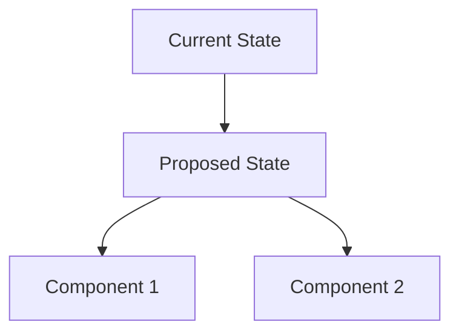

# ADR-XXXX: [Feature/Decision Title]

## Status

- [ ] Proposed
- [ ] Accepted
- [ ] Rejected
- [ ] Superseded by ADR-YYYY
- [ ] Deprecated

**Date:** YYYY-MM-DD  
**Authors:** [Name(s)]  
**Reviewers:** [Name(s)]  
**Related ADRs:** [List any related ADRs]

---

## Context and Problem Statement

### Background
<!-- Describe the current situation and the business/technical context -->
- What business problem are we solving?
- What is the current state of the system?
- What constraints do we have?

### Problem Description
<!-- Clear description of the problem or need -->
- What specific issue needs to be addressed?
- Who are the stakeholders affected?
- What are the success criteria?

### Technical Context
<!-- Current technical landscape -->
- **Tech Stack:** Next.js 15+, React 19+, TypeScript, Supabase, Tailwind CSS
- **Architecture:** [Describe current architecture patterns]
- **Dependencies:** [List relevant dependencies]
- **Performance Requirements:** [If applicable]
- **Security Requirements:** [If applicable]

---

## Decision Drivers

### Functional Requirements

- [ ] **FR-1:** [Requirement description]
- [ ] **FR-2:** [Requirement description]

### Non-Functional Requirements

- [ ] **NFR-1:** Performance (e.g., page load < 2s)
- [ ] **NFR-2:** Security (e.g., GDPR compliance)
- [ ] **NFR-3:** Maintainability
- [ ] **NFR-4:** Scalability
- [ ] **NFR-5:** Accessibility (WCAG 2.1 AA)

### Technical Constraints

- [ ] Must work with existing Supabase setup
- [ ] Must be compatible with current auth flow
- [ ] Must follow existing code patterns
- [ ] Must be responsive (mobile-first)

---

## Considered Options

### Option 1: [Solution Name]

**Description:** [Brief description]

**Pros:**

- ✅ [Advantage 1]
- ✅ [Advantage 2]

**Cons:**

- ❌ [Disadvantage 1]
- ❌ [Disadvantage 2]

**Implementation Effort:** [Low/Medium/High]
**Risk Level:** [Low/Medium/High]

### Option 2: [Solution Name]

**Description:** [Brief description]

**Pros:**

- ✅ [Advantage 1]
- ✅ [Advantage 2]

**Cons:**

- ❌ [Disadvantage 1]
- ❌ [Disadvantage 2]

**Implementation Effort:** [Low/Medium/High]
**Risk Level:** [Low/Medium/High]

### Option 3: [Solution Name]

**Description:** [Brief description]

**Pros:**

- ✅ [Advantage 1]
- ✅ [Advantage 2]

**Cons:**

- ❌ [Disadvantage 1]
- ❌ [Disadvantage 2]

**Implementation Effort:** [Low/Medium/High]
**Risk Level:** [Low/Medium/High]

---

## Decision Outcome

### Chosen Option

**Selected:** Option X - [Solution Name]

### Rationale
<!-- Why this option was chosen -->
- [Reason 1]
- [Reason 2]
- [Reason 3]

### Trade-offs Accepted

- [Trade-off 1 and its justification]
- [Trade-off 2 and its justification]

---

## Implementation Details

### Architecture Changes



### File Structure Changes

```
app/
├── (feature-name)/
│   ├── components/
│   ├── hooks/
│   └── types/
components/
├── feature-name/
│   ├── feature-component.tsx
│   └── index.ts
lib/
├── feature-name/
│   ├── service.ts
│   └── utils.ts
types/
└── feature-name.ts
```

### Key Components

- **Component 1:** `components/feature-name/main-component.tsx`
- **Service Layer:** `lib/feature-name/service.ts`
- **Types:** `types/feature-name.ts`
- **Database Schema:** [If applicable]

### Database Changes
<!-- If database changes are needed -->
```sql
-- Migration script or schema changes
CREATE TABLE IF NOT EXISTS feature_table (
  id UUID PRIMARY KEY DEFAULT gen_random_uuid(),
  user_id UUID REFERENCES auth.users(id),
  created_at TIMESTAMP WITH TIME ZONE DEFAULT NOW(),
  updated_at TIMESTAMP WITH TIME ZONE DEFAULT NOW()
);
```

### API Changes
<!-- If API changes are needed -->
- **New Endpoints:**
  - `GET /api/feature-name` - [Description]
  - `POST /api/feature-name` - [Description]
- **Modified Endpoints:**
  - `PUT /api/existing-endpoint` - [Changes]

---

## Implementation Plan

### Phase 1: Foundation (Week 1)

- [ ] Set up basic file structure
- [ ] Create core types and interfaces
- [ ] Implement database schema changes
- [ ] Create basic service layer

### Phase 2: Core Features (Week 2)

- [ ] Implement main components
- [ ] Add validation logic
- [ ] Create API endpoints
- [ ] Add basic error handling

### Phase 3: Integration (Week 3)

- [ ] Integrate with existing auth system
- [ ] Add proper error boundaries
- [ ] Implement loading states
- [ ] Add accessibility features

### Phase 4: Polish (Week 4)

- [ ] Add comprehensive tests
- [ ] Optimize performance
- [ ] Add proper documentation
- [ ] Conduct security review

---

## Testing Strategy

### Unit Tests

- [ ] Component testing with React Testing Library
- [ ] Service layer testing
- [ ] Utility function testing
- [ ] Type safety validation

### Integration Tests

- [ ] API endpoint testing
- [ ] Database integration testing
- [ ] Auth flow integration
- [ ] End-to-end user workflows

### Performance Tests

- [ ] Page load performance
- [ ] Component render performance
- [ ] Database query performance
- [ ] Bundle size impact

---

## Security Considerations

### Data Protection

- [ ] Input validation and sanitization
- [ ] SQL injection prevention
- [ ] XSS protection
- [ ] CSRF protection

### Authentication & Authorization

- [ ] Proper role-based access control
- [ ] Session management
- [ ] Token validation
- [ ] Rate limiting

### Privacy

- [ ] GDPR compliance
- [ ] Data minimization
- [ ] User consent management
- [ ] Data retention policies

---

## Monitoring and Observability

### Metrics to Track

- [ ] Feature adoption rate
- [ ] Performance metrics (Core Web Vitals)
- [ ] Error rates and types
- [ ] User engagement metrics

### Logging

- [ ] Application logs
- [ ] Error tracking (Sentry/similar)
- [ ] Performance monitoring
- [ ] User behavior analytics

### Alerts

- [ ] Error rate thresholds
- [ ] Performance degradation
- [ ] Security incidents
- [ ] Availability monitoring

---

## Migration Strategy

### Data Migration
<!-- If existing data needs to be migrated -->
- [ ] Backup existing data
- [ ] Create migration scripts
- [ ] Test migration in staging
- [ ] Plan rollback strategy

### Feature Rollout

- [ ] Feature flags implementation
- [ ] Gradual rollout plan
- [ ] A/B testing strategy
- [ ] Rollback procedures

---

## Documentation Requirements

### User Documentation

- [ ] Feature guide for end users
- [ ] FAQ section
- [ ] Help tooltips in UI
- [ ] Video tutorials (if complex)

### Developer Documentation

- [ ] API documentation
- [ ] Component documentation
- [ ] Setup and deployment guide
- [ ] Troubleshooting guide

---

## Risks and Mitigation

### Technical Risks

| Risk | Probability | Impact | Mitigation |
|------|-------------|--------|------------|
| [Risk 1] | [Low/Med/High] | [Low/Med/High] | [Strategy] |
| [Risk 2] | [Low/Med/High] | [Low/Med/High] | [Strategy] |

### Business Risks

| Risk | Probability | Impact | Mitigation |
|------|-------------|--------|------------|
| [Risk 1] | [Low/Med/High] | [Low/Med/High] | [Strategy] |
| [Risk 2] | [Low/Med/High] | [Low/Med/High] | [Strategy] |

---

## Success Metrics

### Technical Metrics

- [ ] **Performance:** Page load time < 2s
- [ ] **Reliability:** 99.9% uptime
- [ ] **Code Quality:** Test coverage > 80%
- [ ] **Security:** Zero critical vulnerabilities

### Business Metrics

- [ ] **Adoption:** X% of users use the feature within 30 days
- [ ] **Engagement:** Average session time increases by X%
- [ ] **Satisfaction:** User satisfaction score > X
- [ ] **Business Impact:** [Relevant business KPI]

---

## Follow-up Actions

### Immediate (Next Sprint)

- [ ] [Action item 1]
- [ ] [Action item 2]

### Short-term (Next Month)

- [ ] [Action item 1]
- [ ] [Action item 2]

### Long-term (Next Quarter)

- [ ] [Action item 1]
- [ ] [Action item 2]

---

## References

### External Resources

- [Link to relevant documentation]
- [Link to best practices guide]
- [Link to similar implementations]

### Internal Resources

- [Link to related ADRs]
- [Link to technical specifications]
- [Link to design documents]

---

## Changelog

| Date | Author | Changes |
|------|--------|---------|
| YYYY-MM-DD | [Name] | Initial draft |
| YYYY-MM-DD | [Name] | [Description of changes] |

---

## AI Assistant Context

### Key Information for Future AI Assistance
<!-- This section helps AI understand the context and decisions made -->

**Feature Summary:** [One-line description of what this feature does]

**Key Files Modified:**

- `app/[feature-path]/page.tsx` - [Purpose]
- `components/[feature]/[component].tsx` - [Purpose]
- `lib/[feature]/service.ts` - [Purpose]
- `types/[feature].ts` - [Purpose]

**Integration Points:**

- **Auth:** [How this feature integrates with authentication]
- **Database:** [What tables/relationships are involved]
- **External APIs:** [Any external services used]

**Common Issues & Solutions:**

- **Issue 1:** [Description] → **Solution:** [How to fix]
- **Issue 2:** [Description] → **Solution:** [How to fix]

**Future Enhancement Opportunities:**

- [Potential improvement 1]
- [Potential improvement 2]

**Dependencies to Consider:**

- [Package/service 1] - [Why it's important]
- [Package/service 2] - [Why it's important]
